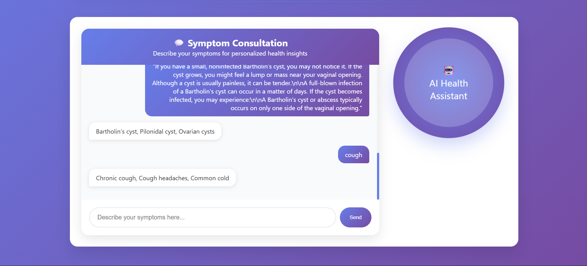

## Smart Health LLM 

**Smart Health** is designed as a modular, scalable, and interactive AI health assistant. It integrates **deep learning**, **large language models (LLMs)**, **vector similarity search**, and **modern web technologies** to provide both **image-based** and **text-based** health assessments. The system follows a **multi-agent architecture** to ensure separation of concerns, maintainability, and high performance.

### 1. System Architecture Overview

The system can be broadly divided into **three layers**:

1. **Frontend Layer**

   * Built using **HTML, CSS, and JavaScript**, creating a responsive and modern user interface.
   * Supports **image uploads**, **real-time chat**, and **interactive displays** like confidence bars and animated orbs.
   * Handles client-side validations, file preview, and dynamic updates for user interactions without page reloads.
   * Communicates with the backend using **HTTP POST requests** for image analysis and chat inputs.

2. **Backend Layer**

   * Developed using **Python** with frameworks like **FastAPI** for asynchronous, high-performance APIs.
   * Orchestrates the **multi-agent system**, routing requests to the appropriate agent (image, symptom, chat, or verification).
   * Handles **file uploads, preprocessing, model inference**, and response formatting.
   * Manages **chat history** and session state to ensure context-aware conversations.
   * Returns structured data to the frontend for rendering dynamic visualizations and chat responses.

3. **AI & ML Layer**

   * **Image Classification Module:**

     * Utilizes a **deep learning CNN (e.g., EfficientNet)** for classifying skin diseases.
     * Preprocessing includes resizing, normalization, and augmentation to improve model accuracy.
     * Provides **predictions with confidence scores**, which are rendered in the frontend.

   * **Symptom Analysis Module:**

     * Uses a **Large Language Model (LLM)** to understand and process natural language inputs.
     * Incorporates **FAISS-based vector similarity search** to match extracted symptoms against structured disease data.
     * Returns **top-k possible diseases** with relevant details like overview, causes, treatment, and preventive tips.

   * **Verification & Recommendation Module:**

     * Optionally cross-checks predictions against external datasets or trusted medical sources.
     * Generates **personalized recommendations** and next steps for the user.

### 2. Multi-Agent System Design

The system follows a **multi-agent approach** to separate responsibilities, improve scalability, and reduce coupling:

* **Image Classification Agent:** Handles image uploads, preprocessing, and deep learning inference.
* **Symptom Analysis Agent:** Manages natural language symptom input, LLM reasoning, and vector similarity matching.
* **Chat & Interaction Agent:** Maintains the chat interface, conversation context, and real-time updates.
* **Verification & Recommendation Agent:** Validates predictions and provides actionable guidance.

**Benefits:**

* Parallel processing allows multiple agents to work simultaneously.
* Each agent is modular, making it easy to maintain and extend.
* Specialized agents increase accuracy and reliability for both image-based and text-based predictions.

### 3. Data Flow & Communication

1. **Image Flow:**

   * User uploads an image → Frontend sends it to backend → Image Classification Agent preprocesses it → Model predicts disease → Backend sends response → Frontend displays prediction with confidence bar.

2. **Symptom Flow:**

   * User types symptoms → Frontend sends input → Symptom Analysis Agent processes via LLM → Symptoms converted to embeddings → FAISS matches similar diseases → Backend formats top results → Frontend shows structured chat response.

3. **Chat Flow:**

   * Chat & Interaction Agent updates conversation in real-time.
   * Maintains context for follow-up questions.
   * Verification agent optionally validates predictions before sending back to user.

### 4. Technology Stack

* **Frontend:** HTML, CSS, JavaScript
* **Backend:** Python, FastAPI, Uvicorn
* **AI/ML:** TensorFlow/PyTorch for CNN, HuggingFace LLM for text, FAISS for vector similarity
* **Utilities:** PIL for image preprocessing, NumPy/Pandas for data handling
* **Deployment:** Can be containerized using Docker for portability and scalability

### 5. Key Advantages

* **Dual-Module Health Assessment:** Supports both image-based and symptom-based analysis.
* **Interactive User Experience:** Modern UI with responsive design, animations, and real-time chat.
* **High Scalability:** Modular multi-agent design allows addition of new agents without affecting existing functionality.
* **Accuracy & Reliability:** Combines deep learning, LLM reasoning, and vector similarity search for robust predictions.
* **Future Extensibility:** New features like lifestyle advice, drug recommendations, or telemedicine integration can be added seamlessly.

<br/>

## Screenshots





<br/>

## Tech Stack

### Frontend

* **HTML** – Structured the frontend for ML web apps, enabling image uploads and symptom-based chat interfaces.
* **CSS** – Styled the app with modern gradients, cards, animations, and responsive layouts for better user experience.
* **JavaScript** – Added interactivity with real-time chat updates, dynamic prediction displays, file upload feedback, and smooth UI interactions.

### Backend

* **Python** – Backend logic and ML integration
* **FastAPI** – High-performance web framework for serving APIs

### AI/ML

* **EfficientNet-B0** – Lightweight and accurate CNN for skin disease prediction
* **all-MiniLM** – Embedding model for semantic search & LLM tasks
* **RAG (Retrieval-Augmented Generation)** – Combines LLM with medical context for better answers
* **FAISS DB** – Fast similarity search for symptom/disease retrieval
* **CUDA** – GPU acceleration for faster training and inference

### DevOps / Deployment

* *(Coming Soon)* – Docker, CI/CD, and cloud deployment tools

<br/>


## System  Design Diagram


<br/>


## Features

- AI-Powered Diagnosis – Predicts skin diseases using EfficientNet-B0
- Symptom-based Chat – Interact with a medical assistant powered by LLM & RAG
- Fast Performance – Optimized with CUDA for GPU-based inference
- Smart Suggestions – Recommends possible causes, treatments, and follow-up questions
- Semantic Search – Finds the most relevant diseases using FAISS & MiniLM embeddings

<br/>

<!--start-->
| Version   | Model Name                                              | Description                                                                                                                                                                                                                                                                                                                                                                                                                    | Top-1   | Top-3   | Top-5   |
|-----------|---------------------------------------------------------|--------------------------------------------------------------------------------------------------------------------------------------------------------------------------------------------------------------------------------------------------------------------------------------------------------------------------------------------------------------------------------------------------------------------------------|---------|---------|---------|
| v1        | Symptom-based FAISS Disease Retrieval                   | Used NER (en_ner_bc5cdr_md) to extract symptoms, MiniLM embeddings word-by-word, FAISS DB with cosine similarity for top‑K matching.                                                                                                                                                                                                                                                                                           | 8%      | 15%     | 18%     |
| v2        | Enhanced Symptom Preprocessing FAISS Retrieval          | Added biomedical NER filtering (biomedical-ner-all) with advanced text cleaning, lemmatization, and medical relevance filtering. MiniLM embeddings stored in FAISS with weighted multi-symptom cosine similarity for improved top‑K disease matching.                                                                                                                                                                          | 16.45%  | 26.35%  | 30.71%  |
| v3        | Enhanced Symptom Preprocessing FAISS Retrieval          | Built a disease symptom database by extracting symptoms via SpaCy biomedical NER model (en_ner_bc5cdr_md) from disease symptom text, generated embeddings for each symptom using HuggingFace MiniLM model (all-MiniLM-L6-v2), stored as a dictionary with symptom lists and their embeddings, then matched user input by extracting symptoms and computing cosine similarity between embedded symptoms to rank top-K diseases. | 92.86%  | 94.9%   | 30.71%  |
| v4        | DiseaseMatcherAgent with LlamaIndex & MiniLM Embeddings | Built a disease symptom database by indexing disease symptom text from Mayo Clinic CSV using LlamaIndex. Embedded symptoms using sentence-transformers/all-MiniLM-L6-v2, then matched user symptom queries via vector similarity retrieval to rank top-K diseases.                                                                                                                                                             | 99.71%  | 99.85%  | 99.86%  |
<!--stop-->

<br/>


## Run Locally

Clone the project

```bash
git clone https://github.com/harmeshgv/SmartHealth-LLM.git
```

Go to the project directory

```bash
cd SmartHealth-LLM
```

Create and activate a virtual environment

```bash
python -m venv venv
venv\Scripts\activate  # For Windows
# or
source venv/bin/activate  # For Linux/macOS
```

Install dependencies

```bash
pip install -r requirements.txt
```

Run backend server (FastAPI)

```bash
cd backend
uvicorn main:app --reload
```

Run frontend (Streamlit)

```bash
cd frontend
streamlit run app.py
```

<br/>

## Installation

```bash
pip install -r requirements.txt
```

<br/>

## Directory Structure

<pre>
SmartHealth-LLM/
├── README.md
├── requirements.txt
├── LICENSE
├── logo.png

├── backend/
│   ├── main.py
│   ├── config.py
│   ├── api/
│   ├── services/
│   ├── models/
│   └── utils/

├── frontend/
│   └── app.py

├── data/
│   ├── mayo_diseases.csv
│   └── Vector/

├── notebooks/
│   ├── skin_disease_prediction.ipynb
│   └── symptom_rag_pipeline.ipynb

├── evaluation/
│   └── evaluate_rag_symptom.py

├── scripts/
│   └── build_vectordb.py
</pre>

<br/>

## Optimizations

 Model Caching – Loaded EfficientNet-B0 and LLM components once during startup to avoid reloading on each request

 CUDA Acceleration – Enabled GPU usage for faster model inference and reduced latency in skin disease prediction

 Efficient Embeddings – Used all-MiniLM to generate lightweight yet accurate embeddings for semantic search

<br/>

## Lessons Learned

Building SmartHealth-LLM gave me hands-on experience in combining deep learning and LLM-based reasoning for real-world healthcare use cases. Some key lessons and challenges:

* **RAG & Retrieval Design:**
  Learned how to build a symptom-based semantic search system using FAISS and MiniLM, and integrate it with a language model for accurate, context-aware responses.

* **Model Integration & Performance:**
  Faced challenges integrating image-based CNN models (EfficientNet-B0) with real-time web applications. Solved it using model caching and optimizing inference with CUDA.

* **LLM Prompt Tuning:**
  Realized the importance of prompt clarity and context when working with LLMs to ensure medical suggestions were structured, useful, and safe.

* **Handling Noisy Medical Data:**
  Built text cleaning and NER filters to extract relevant keywords and symptoms from unstructured input.

* **Frontend-Backend Sync:**
  Gained experience managing interactions between a Streamlit frontend and a FastAPI backend — handling JSON inputs, form validation, and async inference calls.

* **Trade-offs in Real-Time AI Apps:**
  Learned to balance model accuracy with responsiveness and resource usage, especially in a setup where both image and text processing are involved.

<br/>

## Contributing

Contributions are always welcome!

See `contributing.md` for ways to get started.

Please adhere to this project's `code of conduct`.

<br/>


